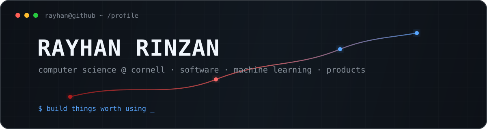

<picture>
  <source media="(prefers-color-scheme: dark)" srcset="./assets/header-dark.svg">
  <source media="(prefers-color-scheme: light)" srcset="./assets/header-light.svg">
  
</picture>

<p align="center">
  <a href="mailto:rmr326@cornell.edu"></a>
  
  
</p>

### `01 / about`

I'm a **Computer Science student at Cornell University** who likes turning messy, interesting problems into software people can actually use.

Right now, I'm especially interested in **software engineering, applied machine learning, data, and startups**. I've worked on medical-image segmentation at **Weill Cornell Medicine** and built end-to-end machine learning and data pipelines.

I care about the entire path from **idea → model/system → interface → useful product**.

---

### `02 / selected work`

<table>
<tr>
<td width="50%" valign="top">

#### 🩻 [GI Tract Image Segmentation](https://github.com/rayhanrinzan/Unet-GI-Tract-Image-Segmentation)
Medical-image segmentation pipeline using a U-Net architecture, custom data loading + augmentation, and experiment tracking.

`Python` `U-Net` `computer vision` `Weights & Biases`

</td>
<td width="50%" valign="top">

#### ⚽ [2026 World Cup Predictor](https://github.com/rayhanrinzan/fifa-world-cup-predictor)
End-to-end football prediction pipeline using recent-form + Elo features, model comparison, calibrated matchup probabilities, and Monte Carlo tournament simulation.

`Python` `scikit-learn` `pandas` `Streamlit`

</td>
</tr>
</table>

---

### `03 / toolbox`

<p align="center">
  
  
  
  
  
  <br>
  
  
  
  
  
</p>

---

### `04 / what I'm exploring`

```text
01  building software with strong product taste
02  machine learning that survives contact with real data
03  startups, user pain points, and useful automation
04  football analytics — because some obsessions deserve datasets
```

---

<p align="center">
  <sub>build → test → learn → ship → repeat</sub>
  <br><br>
  <a href="mailto:rmr326@cornell.edu"><b>say hi ↗</b></a>
</p>
