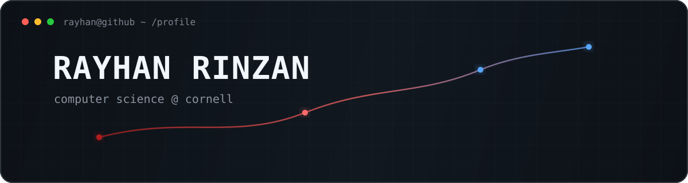

<picture>
  <source media="(prefers-color-scheme: dark)" srcset="./assets/header-dark.svg">
  <source media="(prefers-color-scheme: light)" srcset="./assets/header-light.svg">
  
</picture>

  
  
  

### `01 / about`

I'm interested in **software engineering, applied machine learning, and building useful products**.

---

### `02 / contributions`

<picture>
  <source media="(prefers-color-scheme: dark)" srcset="https://raw.githubusercontent.com/rayhanrinzan/rayhanrinzan/output/github-contribution-grid-snake-dark.svg">
  <source media="(prefers-color-scheme: light)" srcset="https://raw.githubusercontent.com/rayhanrinzan/rayhanrinzan/output/github-contribution-grid-snake.svg">
  
</picture>

---

### `03 / toolbox`

  

---

  <a href="mailto:rmr326@cornell.edu"><b>say hi ↗</b></a>

